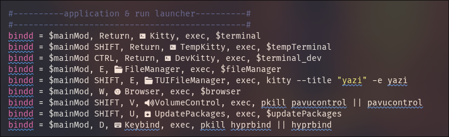

HyprBindはHyprlandのキーバインドを可視化するビュアーです。eguiを使用してRustで開発しました。

GitHub: [ry2x/hyprbind](https://github.com/ry2x/HyprBind)

## 作成の動機

私は日頃から**Hyprland**と言われるウィンドウマネージャ（コンポジター）を使用しています。[Hyprlandとは？](https://wiki.archlinux.jp/index.php/Hyprland)

実際に私がどんな環境を構築して普段から使用しているかはこちらの[記事](/projects/dotfiles)で紹介しています。

Hyprlandは非常に柔軟な設定が可能なWM（ウィンドウマネージャ）で、使用者は自分の好みでキーバインド（ショートカットキー）を自由に設定できます。

しかし、キーバインドの設定はテキストファイル（`~/.config/hypr/hyprland.conf`）に記述されており、特に複雑な設定をしている場合は、どのキーがどのアクションに割り当てられているのかを把握するのが難しいことがあります。

さらに、デスクトップになにも置かない思想であるHyprlandではキーバインドには多くの機能を割り当てることになります。

現に私の環境では、**82個**にも及ぶキーバインドが存在しておりこれを咄嗟に確認したりするのは困難です。
更にHyprlandにはこれらのキーバインドを一覧で表示するような機能も存在しません。


82個のキーバインドが存在する私の環境の設定ファイルの一部：


そこで、**HyprBind**を開発することにしました。HyprBindは、Hyprlandのキーバインドを視覚的に表示することで、ユーザーが自分の設定を簡単に確認できるようにします。

## 開発の思想

HyprBindの開発にあたっては、以下のような思想を持って取り組みました。

- **シンプルなUI**: ユーザーが直感的に操作できるようなシンプルでクリーンなUIを目指す。
- **リアルタイム更新**: 設定ファイルの変更をリアルタイムで反映させることで、ユーザーがすぐに変更を確認できるようにする。
- **柔軟なフィルタリング**: キーバインドの数が多い場合でも、特定のキーやアクションを簡単に見つけられるように、柔軟なフィルタリング機能を実装する。
- **シンプルな依存関係**: Rustとeguiを使用することで、軽量でスタンドアロンで動かすことのできるアプリケーションを目指す。

これらの思想をもとに、HyprBindはユーザーが自分のキーバインドを簡単に管理できるツールとして開発されました。

機能もシンプルに、キーバインドの一覧表示とフィルタリングに特化しています。
要望があればこれ以外の機能も追加していく予定ですが、現状はこのシンプルな機能セットで十分にユーザーのニーズを満たせると考えています。

## 設計・技術的なポイント

### 1. キーバインドの取得方法

HyprBindの設計においては`hyprctl binds`コマンドで現在のHyprlandのキーバインドを取得する方法か、Hyprlandの設定ファイルを直接読み込みパースするのかを検討しました。
できるだけ依存関係をシンプルにするため、`hyprctl binds`コマンドを使用してキーバインドを取得する方法を選択しました。

設定ファイルを読み込む方法は設定ファイルの構造をパースする必要がありますが、Hyprlandの設定ファイルの記述方法はバージョンによって変化したりするのが当たり前です。
そのため、設定ファイルを直接読み込む方法は将来的なメンテナンスの観点からもあまり望ましくないと判断しました。
`hyprctl binds`コマンドを使用する方法は、Hyprlandが提供する公式の方法でキーバインドを取得できるため、将来的な互換性も確保できます。

また、HyprlandはSocketを通じてリアルタイムな情報を取得することも可能ですが、キーバインドの情報は頻繁に変更されるものではないため、`hyprctl binds`コマンドを最初に実行して表示する方法で十分と判断しました。

### 2. クリーンな設計思想

```txt
src/
  main.rs              // エントリーポイント、アプリケーションの初期化と起動。
  app.rs               // アプリケーションのオーケストレーションとグローバル状態。

  cli.rs               // CLI引数の定義（clap derive）。

  config/              // 永続的なユーザー設定
    mod.rs
    user.rs            // UserConfig（シリアライズ可能、安定した設定のみ）
    paths.rs           // config_dir、export_dir、パス解決

  hyprland/            // Hyprlandとのインテグレーション
    mod.rs
    source.rs          // IO境界: hyprctlの呼び出し、rawテキストの取得
    parser.rs          // 純粋なパース: rawテキスト -> ドメインモデル
    models.rs          // KeyBindEntry, KeyBindings（データのみ）

  ui/                  // UIレイヤー（eguiのみ）
    mod.rs
    header.rs
    table.rs
    options.rs
    zen.rs
    types.rs           // UI固有の型定義（例: フィルタリング状態）
    styling/
      mod.rs
      css.rs           // スタイル定義
      fonts.rs         // フォント定義
      icons.rs         // アイコン定義
```

IO境界を明確に分けることで、Hyprlandからのデータ取得とUIのロジックを完全に分離しています。
これにより、将来的にHyprland以外のソースからキーバインドを取得する場合でも、UIロジックを変更せずに対応できます。
また、UIレイヤーも細かく分割することで、各コンポーネントの責任を明確にし、コードの可読性と保守性を向上させています。

ConfigやCSSなどの永続的な設定は、ユーザーが直接編集することも想定しているため、安定した構造を持つように設計しています。
